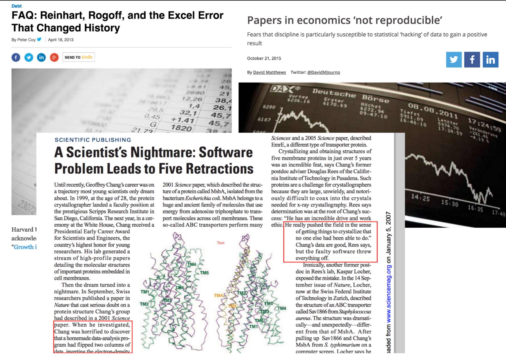
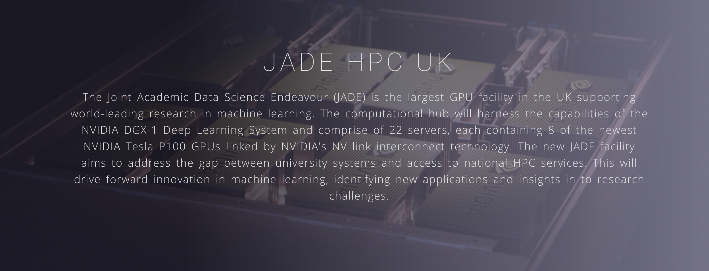
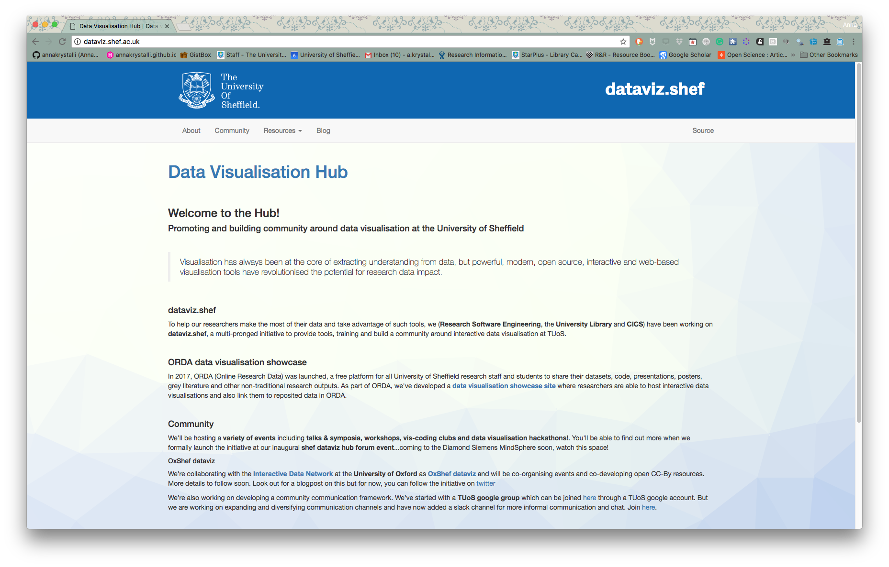

```{r setup, include=FALSE}
options(htmltools.dir.version = FALSE)
library(DiagrammeR)
```

---
background-image: 'assets/RSE_2017.png'

# WHO: we are


---

# WHERE: we came from
---

### UK RSE

---

### EPSRC Fellowships


---

## WHY: we do what we do

---

> "Researchers want to climb epic mountains..."
[Mike Croucher Keynote]()


---

### awesome new adventure gear

<iframe src="https://giphy.com/embed/IO9oLRzXMcHV6" width="480" height="269" frameBorder="0" class="giphy-embed" allowFullScreen></iframe><p><a href="https://giphy.com/gifs/mountains-IO9oLRzXMcHV6">via GIPHY</a></p>

---

## ok, I'm talking about computers

<iframe src="https://giphy.com/embed/qh5xAmz81fzJS" width="480" height="384" frameBorder="0" class="giphy-embed" allowFullScreen></iframe><p><a href="https://giphy.com/gifs/animated-90s-internet-qh5xAmz81fzJS">via GIPHY</a></p>

---

### any fancy new gear can be frustrating


---

### even dangerous!



---

### who do you call?

> "Researchers want to climb epic mountains, we help them get there"
[Mike Croucher Keynote]()


---

# WHAT: we do

- High Performance computing
- code optimisation
- software development
- Training
- Community building

---

# WHERE: we live

```{r, echo = F, eval=FALSE}
grViz("
digraph {

  # graph attributes
  graph [overlap = true,
        layout = dot, rankdir=LR,
        color = crimson]

  # edge attributes
  edge [color = black,
        dir = both,
       arrowhead = inv,
       arrowtail = inv,
       arrowsize = 2]


  # node attributes
  node [shape = circle,
        fontname = Helvetica,
        fixedsize = false,
        style = filled,
        width = 0.9,
        color = cadetblue, fontcolor = white]

  # node statements
  A [label = 'Dept. Computer Science']
  B [label = 'Research Software Engineering']
  C [label = 'CICS']

  # edge statements
  A -> B // gray
  B -> C [dir = forward, arrowhead = open,
       arrowsize = 3]
 
  # subgraph for innovation

  subgraph cluster0 {
  label='INNOVATION';
  fontname = Futura;
    A; B;
  } 
  # subgraph for innovation
  subgraph cluster1 {
    label='PROFESSIONAL SERVICE';
    fontname = Futura;
    B; C;
  }
 
}
")
``` 

---

```{r echo = F, message=FALSE, warning=FALSE}
library(VennDiagram)

# your data
foo <- c("Dept. CompSci", "RSE")
baa <- c("RSE", "CiCS")
vectors <- list(`Research & Development`=foo, `Professional Services`=baa)
# Generate plot
v <- venn.diagram(vectors,
                  fill = c("purple", "aquamarine"), cat.pos = c(345,15),
                  cat.dist = 0.05, col = "cadetblue",
                  alpha = c(0.3, 0.5), cat.cex = 1.5, cex=1.5,
                  filename=NULL, imagetype = "svg",
                  fontfamily = "Helvetica",
                  cat.fontfamily= "Helvetica")

v[[5]]$label  <- paste(setdiff(foo, baa), collapse="\n")  
# in baa only
v[[6]]$label <- paste(setdiff(baa, foo)  , collapse="\n")  
# intesection
v[[7]]$label <- paste(intersect(foo, baa), collapse="\n")  

# plot  
grid.newpage()
grid.draw(v)
```

---

## WHO: we work with

```{r partners, echo = F}
###
# Create a graph with both nodes and edges
# defined, and, add some default attributes
# for nodes and edges
###
#dev.off()
grViz("
digraph {

  # graph attributes
  graph [overlap = true,
        rankdir=LR,
        layout = dot, 
        color = black,
        fontsize = 56,
        fontname = Helvetica,
        size='10,10']

  # edge attributes
  edge [color = black,
       arrowhead = inv,
       arrowtail = inv,
        dir = both]


  # node attributes
  node [shape = oval,
        fontname = Helvetica,
        fixedsize = true,
        style = filled,
        width = 4,
        height = 4,
        fontsize = 56,
        rank = same]

  # node statements
  node [color = darkorchid, fontcolor = white]
  A [label = 'EU']
  B [label = 'National']
  node [color = cadetblue, fontcolor = white]
  C [label = 'Institutional']
  D [label = 'Faculty']
  E [label = 'Departmental']
 node [color = aquamarine, fontcolor = black]
  F [label = 'Group']
  G [label = 'Individuals']


 # subgraph for innovation
 subgraph cluster1 {
    label = 'external partnerships';
    color = black
    A B
  } 

  subgraph cluster2 {
    label = 'institutional partnerships';
    C D E
  } 

  subgraph cluster3 {
  label = 'researcher partnerships';
    F G
  } 
  # edge statements
  A -> B -> C -> D -> E -> F -> G


}
", height = 300)
```

---

### EU
#### OpenDreamKit


```{r partners-external, echo = F}
###
# Create a graph with both nodes and edges
# defined, and, add some default attributes
# for nodes and edges
###

grViz("
digraph {

  # graph attributes
  graph [overlap = true,
        rankdir=LR,
        layout = dot, 
        color = black]

  # edge attributes
  edge [color = black,
       arrowhead = inv,
       arrowtail = inv,
        dir = both]


  # node attributes
  node [shape = oval,
        fontname = Helvetica,
        fixedsize = false,
        style = filled,
        width = 0.9,
        rank = same,
        color = grey34, fontcolor = white]

  # node statements
  C [label = 'Institutional']
  D [label = 'Faculty']
  E [label = 'Departmental']
  F [label = 'Group']
  G [label = 'Individuals']

  node [color = darkorchid, fontcolor = white]
  A [label = 'EU']
  B [label = 'National']

 # subgraph for innovation
 subgraph cluster1 {
    label = 'external partnerships';
    color = black
    A B
  } 

  # edge statements
  A -> B -> C -> D -> E -> F -> G


}
")
```

---

##### juyter on HPC

---

##### modules template
- http://bitsandchips.me/Modules-template-docs/about/

---

## National
---

### Jade



---

### Insigneo


---


### institutional

```{r partners-institutional, echo = F}
###
# Create a graph with both nodes and edges
# defined, and, add some default attributes
# for nodes and edges
###

grViz("
digraph {

  # graph attributes
  graph [overlap = true,
        rankdir=LR,
        layout = dot, 
        color = black]

  # edge attributes
  edge [color = black,
       arrowhead = inv,
       arrowtail = inv,
        dir = both]


  # node attributes
  node [shape = oval,
        fontname = Helvetica,
        fixedsize = false,
        style = filled,
        width = 0.9,
        rank = same, color = grey34, fontcolor = white]

  # node statements
  A [label = 'EU']
  B [label = 'National']
  F [label = 'Group']
  G [label = 'Individuals']

  node [color = cadetblue, fontcolor = white]
  C [label = 'Institutional']
  D [label = 'Faculty']
  E [label = 'Departmental']


  subgraph cluster2 {
    label = 'institutional partnerships';
    C D E
  } 

  # edge statements
  A -> B -> C -> D -> E -> F -> G


}
")
```

---

### Institutional: dataviz.shef




---

## researcher level

```{r partners-research, echo = F}
###
# Create a graph with both nodes and edges
# defined, and, add some default attributes
# for nodes and edges
###

grViz("
digraph {

  # graph attributes
  graph [overlap = true,
        rankdir=LR,
        layout = dot, 
        color = black]

  # edge attributes
  edge [color = black,
       arrowhead = inv,
       arrowtail = inv,
        dir = both]


  # node attributes
  node [shape = oval,
        fontname = Helvetica,
        fixedsize = false,
        style = filled,
        width = 0.9,
        rank = same, color = grey34, fontcolor = white]

  # node statements
  A [label = 'EU']
  B [label = 'National']
  C [label = 'Institutional']
  D [label = 'Faculty']
  E [label = 'Departmental']

 node [color = aquamarine, fontcolor = black]
  F [label = 'Group']
  G [label = 'Individuals']

  subgraph cluster3 {
  label = 'researcher partnerships';
    F G
  } 
  # edge statements
  A -> B -> C -> D -> E -> F -> G


}
")
```

---

### The long tail of research

<iframe src="https://widgets.figshare.com/articles/106458/embed?show_title=1" width="900" height="700" frameborder="0"></iframe>

---

### OOOMINDS - Grant level support for 3

"


---

### Researchers


---

## Community & Capacity building

<iframe src="https://giphy.com/embed/i04wdjzz8xfyM" width="480" height="480" frameBorder="0" class="giphy-embed" allowFullScreen></iframe><p><a href="https://giphy.com/gifs/network-i04wdjzz8xfyM">via GIPHY</a></p>